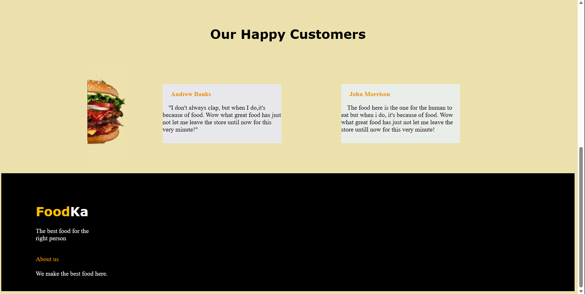

# commercial-website
# Aim 
To create a commercial website using html and css
# Algorithm
1. Create a html and css files
2. Create your own commercial website
# Program
# index.html
```
<!DOCTYPE html>
<html>
    <head>
        <title>Foodka</title>
        <link rel="stylesheet" href="style.css">
    </head>
    <body>
        <div class="first">
            <h1>Food<span>Ka</span></h1>
                <a href="#">Home</a>
                <a href="#">About</a>
                <a href="#">Catalog</a>
            <button>OrderNow</button>
        </div>
        <div class="second">
        
            <h1>Quality food<br>Delivered!</h1>
            <p>We provide quality fast food items at excellent offers<br><span>Buy</span> 1 Burger Get 1 <span>Free</span><br><span>Buy</span> 1 Pizza Get 1 <span>Free</span></p>
            <br>
            <br>
            <button>Get Started</button>
        </div>
        <br>
        <br>
        <div class="third">
            
            <h1>Traditional<br>Vegetarian Food</h1>
            <p><b>Vegetarian food is good for health and that's what we provide<br>here in <span>FoodKa,</span>as we focus on customers health before<br>money reaches the table.</b></p>
            <button>Order Veg Food</button>
        </div>
        <br>
        <br>
        <br>
        <br>
        <br>
        <br>
        <br>
        <br>
        <h1><center>Our Happy Customers</center></h1>
        <br>
        <br>
        <div class="impo">
            
        <div class="box1">
           <p>John Morrison</p>
           <p1>The food here is the one for the human to eat but when i do, it's because of food. Wow what great food has just not let me leave the store untill now for this very minute! </p1> 
        </div>
        <div class="box2">
            <p>Andrew Banks</p>
            <p1>"I don't always clap, but when I do,it's  because of food. Wow what great food has just not let me leave the store until now for this very minute!"</p1>  
        </div>
    </div>
        <br>
        <br>
        <br>
        <br>
        <br>
        <br>
        <br>
        <br>
        <br>
        <br>
        <br>
        <br>
        <br>
        <br>
        <br>
        <footer>
            <br>
            <br>
            <br>
            <div class="foot1">
                <h1><span>Food</span>Ka</h1>
                <p>The best food for the <br>right person</p>
                <br>
                <p1>About us</p1>
                <br>
                <br>
                <p2>We make the best food here.</p2>
            </div>
        </footer>
    </body>
</html>
```
# style.css
```
.first h1{
    font-family: 'Segoe UI', Tahoma, Geneva, Verdana, sans-serif;
}
.first h1 span{
    color: rgb(255, 191, 0);
}
.first{
    display: flex;
    justify-content: space-evenly;
    align-items: center;
}
.first a{
   color: black;
   font-family: 'Segoe UI', Tahoma, Geneva, Verdana, sans-serif;
   transition: .4s ease;
}
.first a:hover{
    color: rgb(0, 34, 226);
}
body{
    background-color: #ece1ac;
}
.first button{
    background-color: #ece1ac;
    border-radius: 40px;
    width: 160px;
    height: 40px;
    border-color: yellow;
    color: gray;
}
 .second h1{
    font-family:system-ui, -apple-system, BlinkMacSystemFont, 'Segoe UI', Roboto, Oxygen, Ubuntu, Cantarell, 'Open Sans', 'Helvetica Neue', sans-serif;
    margin-left: 20%;
}
 .second p{
    font-family: 'Segoe UI', Tahoma, Geneva, Verdana, sans-serif;
    margin-left: 20%;
}
.second img{
    margin-right: 20%;
}
.second button{
    background-color: #ec990b;
    border-radius: 40px;
    width: 160px;
    height: 40px;
    border-color: #ec990b;
    color: white;
    margin-left: 20%;
}
.third h1{
    font-family:Cambria, Cochin, Georgia, Times, 'Times New Roman', serif;
    
}
.third p{
    font-family:'Franklin Gothic Medium', 'Arial Narrow', Arial, sans-serif;
    
}
.third span{
    color: rgb(255, 179, 0);
}
.third button{
    background-color: rgb(38, 36, 36);
    color: #ec990b;
    width: 200px;
    height: 40px;
}
.third img{
    margin-left: 15%;
}
.box1{
    width:300px; 
    float:right; 
    background: rgb(233, 238, 233); 
    height: 150px;
    margin: 50px;
    margin-right: 20%;
}
h1{
    font-family:Verdana, Geneva, Tahoma, sans-serif;
}
.box2{
    width:300px; 
  height: 150px; 
  float:right; 
  background: rgb(232, 232, 236);
  margin: 50px;
  margin-right: 7%;
}
.box2 p{
    color: #ec990b;
    font-weight: bolder;
    margin-left: 7%;
}
.box2 p1{
    color: #090909;
    margin-left: 5%;
}
.impo img{
    margin-left: 15%;
    height: 250px;
}
.box1 p{
    color: #ec990b;
    font-weight: bolder;
    margin-left: 7%;
}
.box1 p1{
    color: #090909;
    margin-left: 5%;
}
footer{
    background-color: black;
    color: white;
    width: 100%;
    height: 40vh;
}
footer h1{
    margin-left: 6%;
}
footer h1 span{
    color: rgb(255, 191, 0);
}
footer p{
    margin-left: 6%;
}
footer p1{
    color: #ec990b;
    margin-left: 6%;
}
footer p2{
    margin-left: 6%;
}
.second p span{
    color:#1b0cf0;
}
```
# Output 


# Result 
Thus a commercial website using html and css is done successfully.